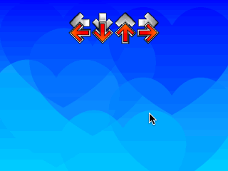

### Status
 * Loads simfiles with only quarter notes. Plays them.
 * Needs to be properly synced.
 * Needs to implement everything that's not quarter notes.
 * I'm satisfied with where the project's at for the time being. I learned
  plenty. I need to finish school, anyhoo.


### Design goals
 * Statically linked
 * parses regular simfiles
 * m630 Cel
 * Works on our cab

### Style
 * Tabs
 * 75 character wide lines

### Installation
```
# Install SFML https://www.sfml-dev.org/tutorials/2.5/
git clone git@github.com:ddrillini/stepminia.git # use ssh pls
cd stepminia
mkdir build && cd build
cmake ..
make
```
